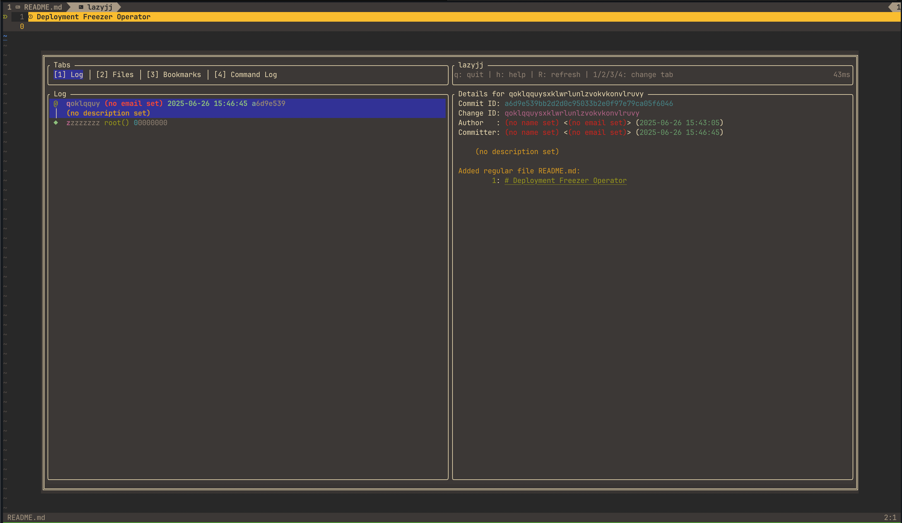

# lazyjj.nvim

A Neovim plugin that provides a floating window interface for
[lazyjj](https://github.com/Cretezy/lazyjj).



## Requirements

- Neovim >= 0.5.0
- [plenary.nvim](https://github.com/nvim-lua/plenary.nvim)
- [lazyjj](https://github.com/Cretezy/lazyjj) installed and available in your PATH

## Installation

Using [packer.nvim](https://github.com/wbthomason/packer.nvim):

```lua
use {
    'swaits/lazyjj.nvim',
    requires = 'nvim-lua/plenary.nvim',
    config = function()
        require('lazyjj').setup()
    end
}
```

Using [lazy.nvim](https://github.com/folke/lazy.nvim):

```lua
{
    'swaits/lazyjj.nvim',
    dependencies = 'nvim-lua/plenary.nvim',
    opts = {}
}
```

## Configuration

The plugin can be configured by passing options to the setup function:

```lua
require('lazyjj').setup({
    mapping = '<leader>jj'  -- Change the default keymap
})
```

Or when using [lazy.nvim](https://github.com/folke/lazy.nvim):

```lua
{
    'swaits/lazyjj.nvim',
    dependencies = 'nvim-lua/plenary.nvim',
    opts = {
      mapping = '<leader>jj'
    }
}
```

## Usage

- Use the configured keymap (default: `<leader>jj`) to open `lazyjj` in a floating
  window
- Or use the `:LazyJJ` command
- Press `q` or lose focus to close the window
- The window will automatically return focus to your previous window when
  closing `lazyjj`

## License

This plugin is licensed under the [MIT license](LICENSE).
